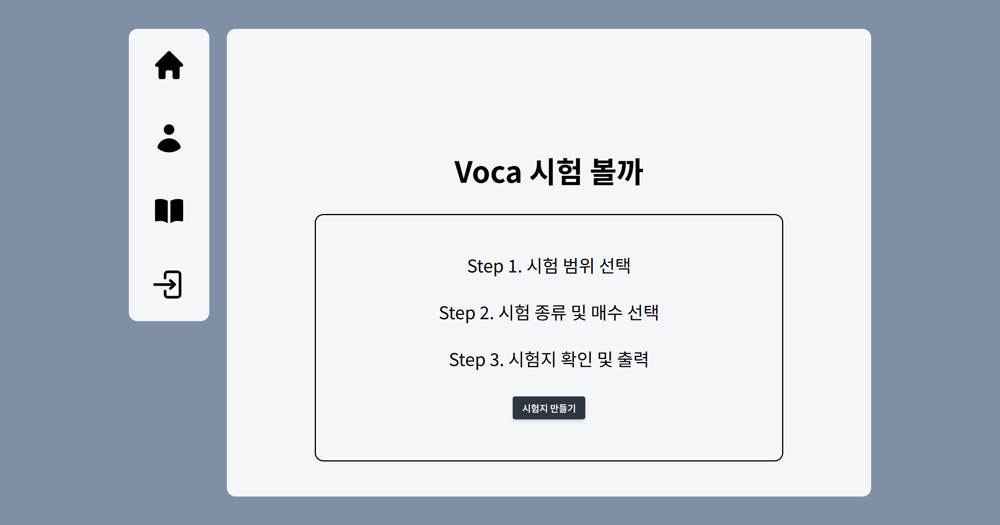
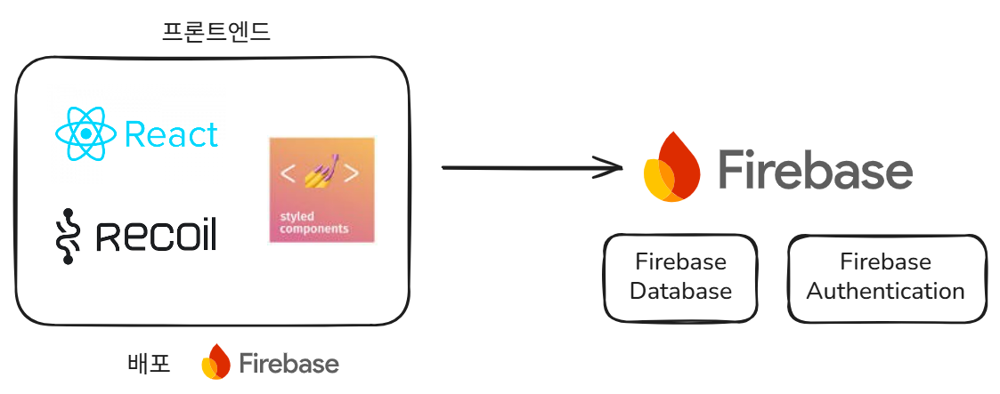

# Voca 시험 볼까

본 프로젝트는 단어 시험지를 간편하게 생성하고 출력할 수 있는 웹 애플리케이션입니다.
Firebase를 활용하여 **사용자 인증, 데이터 저장, 배포** 기능을 구현하였습니다.

## 프로젝트 소개

### 프로젝트 아키텍처

프로젝트의 아키텍처입니다.
Firebase를 사용하여 배포하였습니다. DB 또한 Firebase Database를 사용하였습니다.

### 프로젝트 라이브러리

프로젝트에 사용된 스킬입니다.
 

 

## 서비스 배포 링크

배포 링크 : [https://my-voca-947ab.web.app](https://my-voca-947ab.web.app)

 

## 주요 기능 소개

기존 단어 시험지 생성 웹사이트는 사용자 입력이 불편하다는 의견이 있어 사용자 친화적인 디자인으로 재구성하였습니다.

계정 생성 및 로그인이 가능하고 DB에 저장되어 있는 데이터들을 바탕으로 단어 시험지를 만들고 출력할 수 있습니다. 로그인 한 사용자는 만들었던 시험지를 저장하여 프로필 창에서 다시 확인이 가능합니다.

 

## 개발 주요 로드맵

- [x] 단어 시험지 생성 구현
- [x] 나만의 시험지 저장 구현
- [ ] 타입스크립트 전환
- [ ] 단어 게임 구현

 

## 개발자

이마가: 프론트엔드 개발 및 배포  
✉️ 이메일: cbfmark@gmail.com  
🏠 블로그: [https://velog.io/@cbfmark/posts](https://velog.io/@cbfmark/posts)
